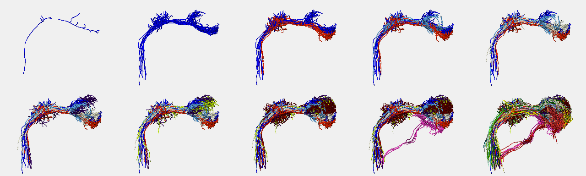

# PNVisualisationInAmira
Scripts and data to compare different groups of Drosophila olfactory projection neurons in Amira



## Installation

Use the **Download ZIP** button and expand or clone the repository to a sensible location.

## Loading data into Amira

1. Open **masterObject.scro** in Amira (you can do this by drag and drop or double clicking).
2. Click on the **LoadAll** button
3. Now you can click on the **HideAll**/**ShowAll** button to hide or show all neurons

## Changing the display

1. You can select groups of neurons using the check boxes
2. You can change the colour of the currently selected neurons with the **Red**, 
   **Green** and **Blue** sliders
3. You can also change the **Width**

## Colouring neurons programmatically

You can colour all of the neurons from a single glomerulus by going to Amira's
Console and issuing a command of the form:

```
DM3 setrgb 1 1 .4 
```

An example of doing this for all glomeruli is presented in [`setneuroncolors.hx`](amira/setneuroncolors.hx).
You can drag and drop this script onto the Amira object pool and it will set all
of these colours.

## Snapshots
To make a series of snapshots, INSTRUCTIONS are at the top [`makesnapshots.hx`](amira/makesnapshots.hx).

## Further Information
Contact Greg or see flybrain.stanford.edu for more details.
